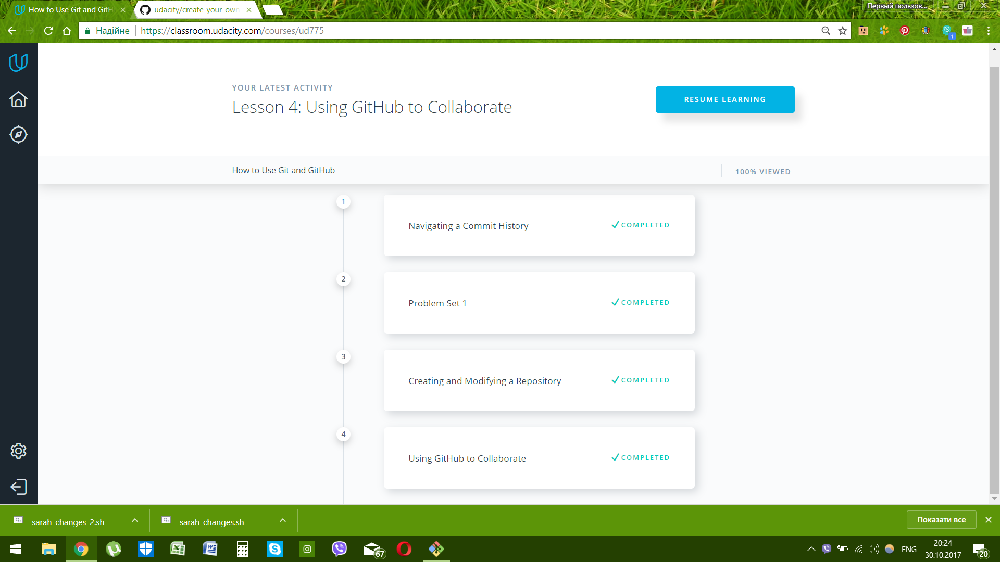
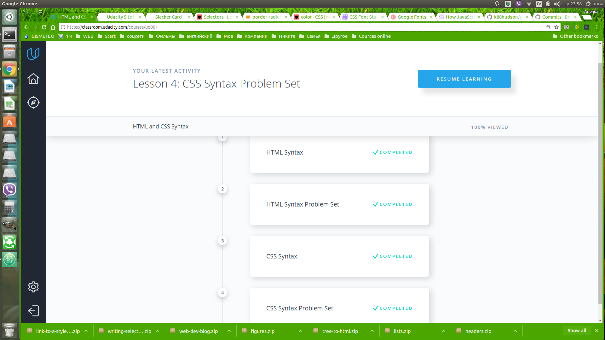
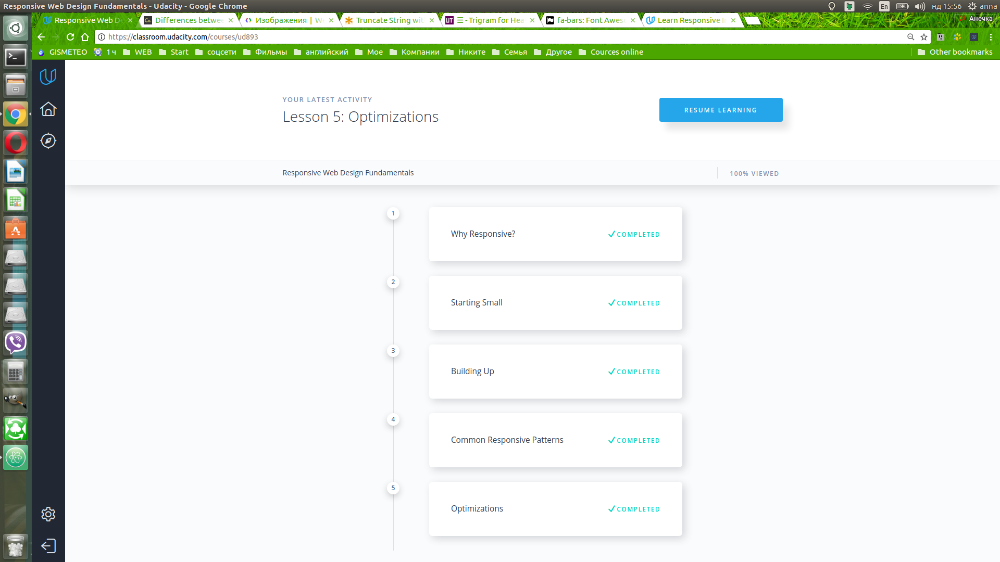
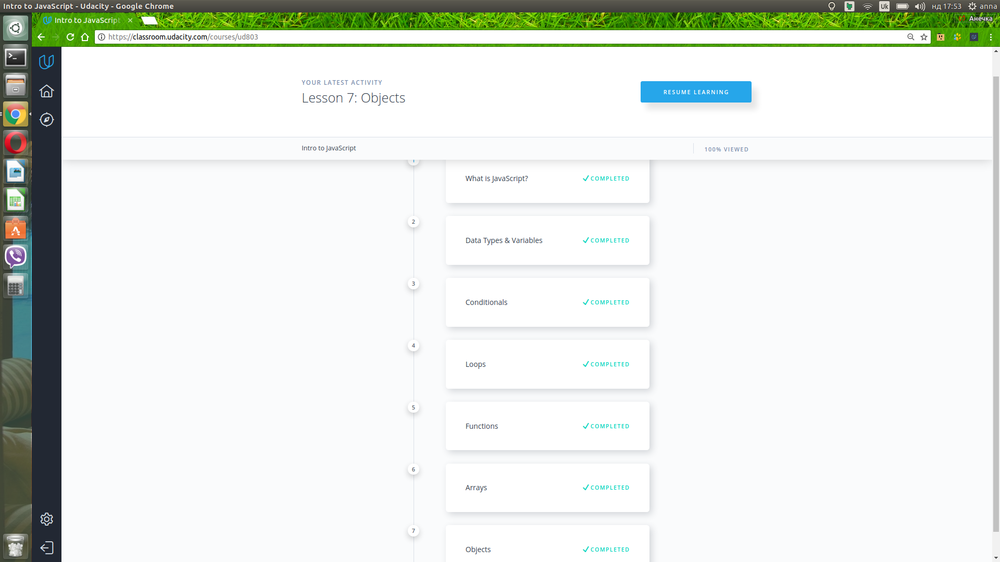
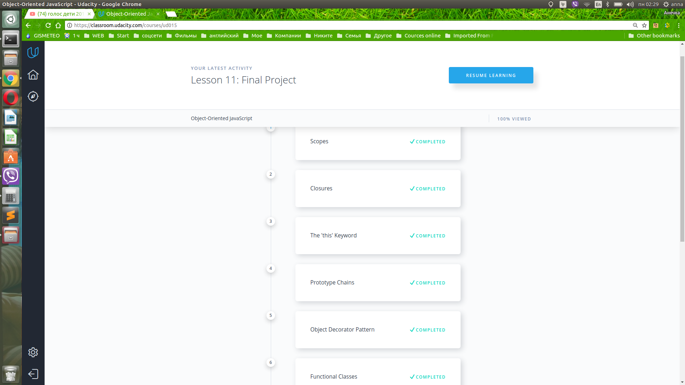
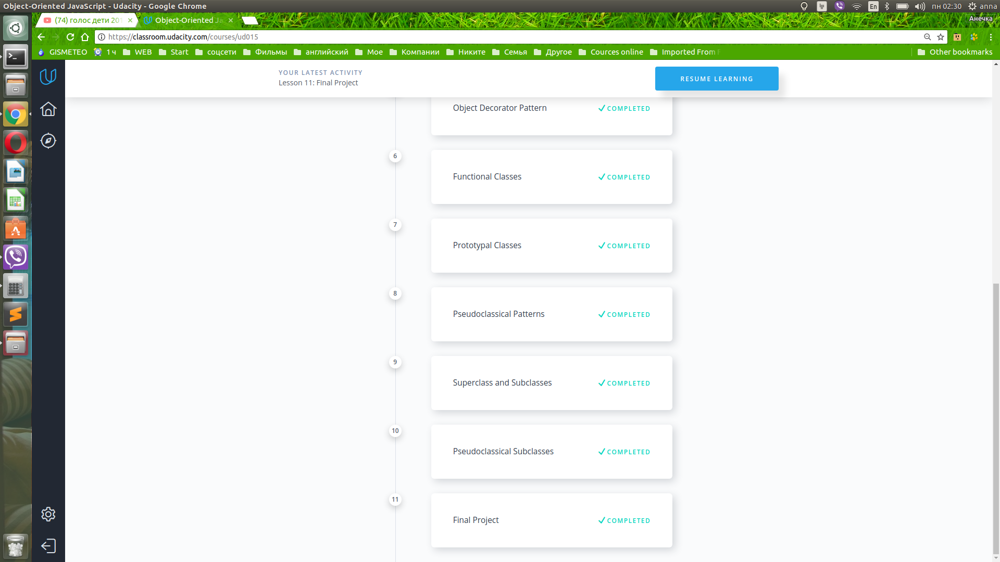
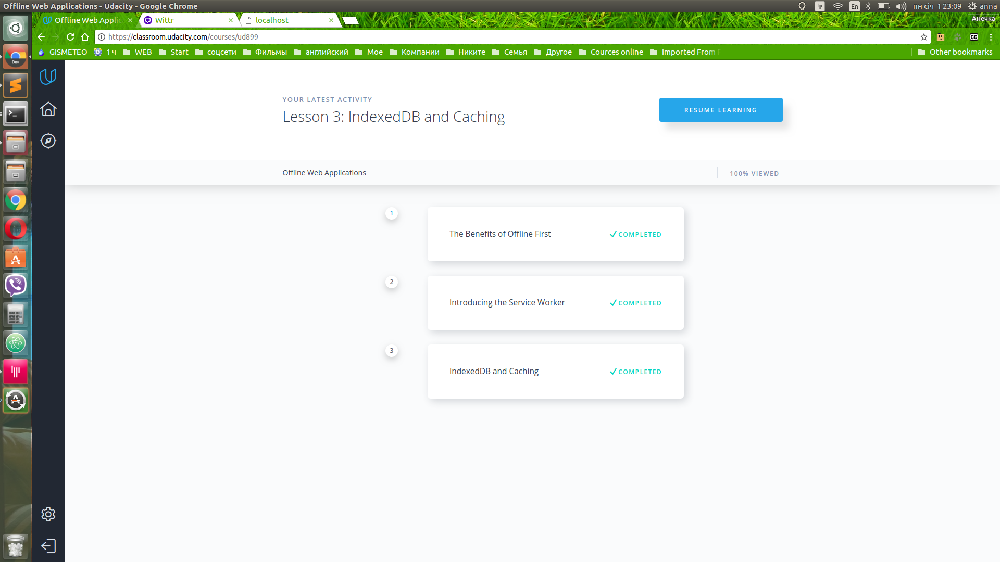
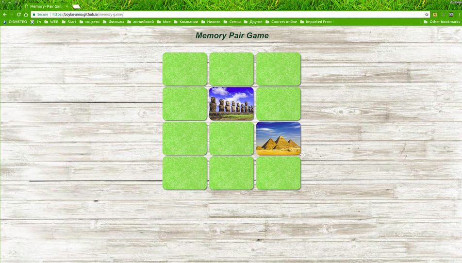

### **Task 0 (get familiar with Git and GitHub):**

1. Finish the course How to use Git and GitHub

The information in this course wasn't new to me. But it was usefull to refresh it in my memory.

2. Finish try.github.io

After the udacity course this course was really easy to complete. 

3. Create repository named "kottans_frontend".

Done. https://github.com/Boyko-Anna/kottans_frontend

4. Create README.md for the repository.

Done.

5. Describe your impressions about learned materials.

Done.

6. Send a pull-request to repo Kottans/mock-repo proposing a change.

Ok. Right after I'll finish writing in here.

### **Task 1 (Learn some command line, server and http tools):**

1. "Linux Command Line Basics" course

	I have Ubuntu as my second OS. So I've already been familiar with Linux terminal and have used several shell commands. So it was easy to compleate this course.

2. "Configuring Linux Web Servers" course

	It was realy a challenge for me to complete the next two courses, although some themes wasn't completely new to me. A lot of new programs and shell commands forced me to re-read and re-watch the material for several times. I honestly tried to figure out how everything worked, but the information of that kind is really hard to understand. And the main conclusion I've made is that I'll need to search for some additional information on these themes and maybe even go back to these courses in some time later.

3. "Networking for Web Developers" course

4. Articles "HTTP: The Protocol Every Web Developer Must Know - Part 1" and "HTTP: The Protocol Every Web Developer Must Know - Part 2".

	It was interesting to get to know about the difference between the types of connections in HTTP/1.0 and HTTP/1.1 versions. 
	The status codes, request\response headers, all of these I will definatelly see and use in my future researches and work.

### **Task 2**

0. "Version control with Git" course	

	The most usefull information from this course was the "git log" command with it's various flags. I finally got the instrument to work with the commits history!
	The "git commit --amend", "git revert", "git reset" commands were completely new to me.
	Also I've finally understood what the fast-forward merge is. It's so simple! How could I misunderstand such a simple thing... The explanation videos in this course are great and they are much better that in the "How to use Git and GitHub" course!

1. "GitHub & Collaboration" course

	I liked the idea of squashing commits by using the "git rebase" command. I think I'll frequently be using it in future.

2. Send a message in gitter channel with the link to you repo and "@/all" tag.

	Done.

### **Task 3**

1. "HTML and CSS Syntax" course

	The information given in this course wasn't new to me, but it was interesting to refresh some details in my memory such as the order of values in shorthand properties.

### **Task 4**

1. "Responsive Web Design Fundamentals" course

	I've learned a lot from this course. Althought the concept of responsive web design isn't new to me but it was so interesting to see how it's implemented in practice using CSS. 
	And the games in extra materials are great! 

### **Task 5**

1. "Intro to JavaScript" course

	It was really an "intro" to JavaScript. All basic constructions were presented but too litle practice. Can't wait to begin the next JS course!

### **Task 6**

1. "Object-Oriented JavaScript" course

	Scopes, closures, prototype chains, these concepts were quite easy to understand. But I need to learn much more about the concept of Prototypal classes and the JS patterns.
	[Frogger game](https://github.com/Boyko-Anna/frontend-nanodegree-arcade-game)

### **Task 7**

1. "Offline Web Applications" course

	I finally completed this course! As for me I think this course is not for the beginners like I am. At first I thought: "That's a really good idea 'Offline first', I can get it!", but during the other 2/3 of the course I spent 95% of my time trying to understand the code and on the last chapter I think I failed doing that... So the main conclusion is that I will need to study this course once again in future with more knowledge of JS.

 

### **Task 8**

## Memory pair game

Source: [GitHub](https://github.com/Boyko-Anna/memory-game/)
Demo: [GitHub pages](https://boyko-anna.github.io/memory-game/)

	It was really a chalange but I did it! And still I have a lot of questions remained.

### **Task 10** 

## [Weather application](https://kottans-frontend-2018.github.io/assignments_Boyko-Anna/task_10/dist/) . 
Source: [GitHub](https://github.com/kottans-frontend-2018/assignments_Boyko-Anna/tree/task_10) .

### **Task 11** 

## [Simple layout](https://kottans-frontend-2018.github.io/assignments_Boyko-Anna/task_11/) . 
Source: [GitHub](https://github.com/kottans-frontend-2018/assignments_Boyko-Anna/tree/task_11) .
